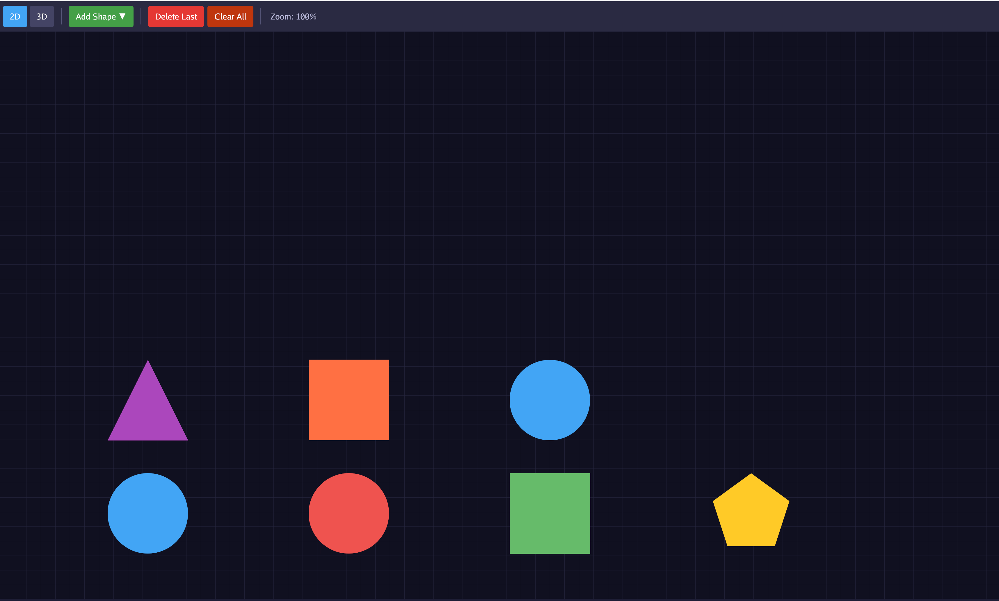

# kphy-engine
玩具物理引擎-golang

## 规划
1. AI 实现 UI 相关功能和部分测试函数（这部分不是重点）
2. AI 协助规划项目架构（重点）
3. 2D（优先）
4. 3D（次优）

- UI（AI 协助实现）
- 先实现 math/ 包的向量和矩阵运算
- 再实现 physics/ 的形状和刚体
- 然后是 collision/ 的碰撞检测
- 最后是 solver/ 的解算逻辑

## Progress
- [x] UI(AI 协助实现) 
- [x] math/vector2 向量运算
- [x] math/matrix 矩阵运算
- [] physics/ 的形状和刚体
- [] collision/ 的碰撞检测
- [] solver/ 的解算逻辑

## 架构s
[架构图](ARCHITECTURE.md)

## 坐标系
1. 2D 场景的坐标原点为左下角，向上是 Y 正半轴，向右是 X 正半轴
2. 3D场景 Z 正半轴默认向上

## RUN
`go run main.go`

